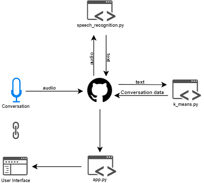

# k_means_organizational_culture

KAREN leverages the K-Means Natural Language Processing algorithm to convert conversations like employee check-ins to insights into group culture.

## Prerequisites

* Copy a Speech Key and Service Region from [Microsoft Azure Cognitive Services Speech Service](https://docs.microsoft.com/en-us/azure/cognitive-services/Speech-Service/) to speech_recognition.py 

```
speech_key, service_region = "speech key here", "service region here"
```

* Download [Chrome](https://www.google.com/chrome/b/)
* Download [Python](https://www.python.org/downloads/)
* Download [Git](https://git-scm.com/download/win)
* Navigate to Command Prompt (Windows) or Terminal (MacOS) and run
```
curl https://bootstrap.pypa.io/get-pip.py -o get-pip.py
```
```
python get-pip.py
```

At this point you should have all the required prerequisites to install the dependancies

## Dependancies

* Navigate to Command Prompt (Windows) or Terminal (MacOS) and run

```
pip install --upgrade pip
```
```
pip install -r requirements.txt
```

At this point you almost have all the dependancies required to run the applicaiton, except these little devils

```
pip install -U spacy
```
```
python -m spacy download en_core_web_sm
```

At this point you should have all the dependancies required to run the application

## Run the Application

Navigate to Command Prompt (Windows) or Terminal (MacOS) and run

```
git clone https://github.com/jr2021/intern-project-2019.git
```

```
cd intern-project-2019
```

* On Command Prompt run

```
set FLASK_APP=flaskr
```
```
set FLASK_ENV=development
```

* On Terminal run

```
export FLASK_APP=flaskr
```
```
export FLASK_ENV=development
```

* On Command Prompt and Terminal run

```
flask run
```

At this point you should see the following output in Command Prompt or Terminal

```
Serving Flask app "flaskr" (lazy loading)
 * Environment: development
 * Debug mode: on
 * Restarting with stat
 * Debugger is active!
 * Debugger PIN: 838-803-860
 * Running on http://127.0.0.1:5000/ (Press CTRL+C to quit)
```

* Navigate to http://127.0.0.1:5000/ in Chrome to load the application

## Languages and Frameworks

* [Python](https://www.python.org/)
* [Flask](https://flask.palletsprojects.com/en/1.1.x/)
* [Microsoft Azure Cognitive Speech Service](https://docs.microsoft.com/en-us/azure/cognitive-services/Speech-Service/)
* [Spacy](https://spacy.io/)
* [scikit-learn](https://scikit-learn.org/stable/)
* [Plotly](https://plot.ly/python/)
* [JavaScript](https://www.javascript.com/)

## Contributors

* [Jake Robertson](https://www.linkedin.com/in/jr2021/) - Natural Language Processing
* [Vishal Tiruveedi](https://www.linkedin.com/in/vishaltiruveedi/) - Back End
* [Dan Miguel Esponisa](https://www.linkedin.com/in/dan-miguel-espinosa-98265267) - Front End
* [Sathvika Korandla](https://www.linkedin.com/in/sathvika-korandla123/) - Natural Language Processing
* [Paige Courtemanche](https://www.linkedin.com/in/paige-courtemanche-634583188) - Front End

## Data Flow


